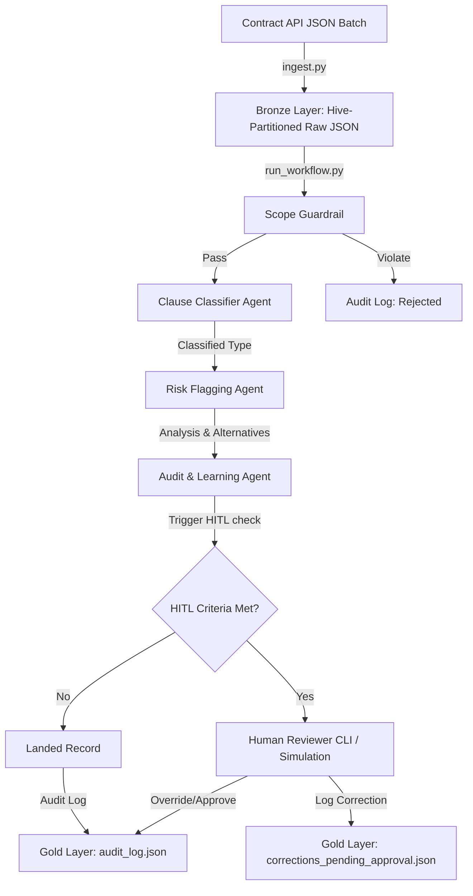

# Contract Intelligence Pipeline: Developer Guide

This repository contains a production-grade, highly durable Contract Intelligence Pipeline developed for a fictional Architecture & Engineering (A/E) firm. The pipeline automates the ingestion of contract clause data, detects schema drift across API versions, classifies clauses, flags unfavourable/uninsurable language, and tracks operational audits.

---

## 1. System Architecture

The pipeline uses a flat-file medallion-style architecture:



### Execution Flow
1. **Phase 1: Raw Landing (`phase1_ingestion/ingest.py`)**:
   - Parses the input file batch.
   - Extracts and compares the schema structure against the baseline (`schema_baseline.json`).
   - If schema differences (renames, additions, removals) occur, writes a drift report (`drift_report_*.json`).
   - Lands the raw clause data into Hive-style partition directories in the Bronze layer, tracking progress in `ingestion_state.json` to support clean resumability.
2. **Phase 2: Review & Orchestration (`phase2_agents/run_workflow.py`)**:
   - Scans the Bronze partition directories for raw clause JSON records.
   - For each clause, checks the **Scope Boundary Guardrail** to filter out non-contractual text or injections.
   - Invokes the **Clause Classifier Agent** to categorize the clause.
   - Invokes the **Risk Flagging Agent** to analyze A/E specific liabilities and propose alternative language.
   - Checks **Human-In-The-Loop (HITL)** triggers (low confidence or critical risk flags). If met, prompts for interactive overrides (CLI) or logs automated simulations.
   - The **Audit & Learning Agent** logs the complete run transaction state to `audit_log.json` and stages human overrides in `corrections_pending_approval.json`.
   - **Cost Budget Guardrails** monitor accumulated token counts throughout the execution, immediately halting the pipeline if limits are exceeded.

---

## 2. Repository Layout

```
multi-agent/
├── README.md                           # Master Developer & Setup Guide
├── data/                               # Dataset Storage
│   ├── clauses_batch_1.json            # Original Schema API Batch (v2.1)
│   ├── clauses_batch_2.json            # Drifted Schema API Batch (v2.3)
│   └── clauses_ingested_fallback.json  # Pre-ingested fallback dataset
├── phase1_ingestion/                   # Phase 1 Ingestion Logic
│   ├── ingest.py                       # Ingestion runner script
│   ├── data_contract.md                # Data contract specifications
│   ├── schema_baseline.json            # Auto-generated schema baseline file
│   ├── ingestion_state.json            # Ingestion resumability checkpoints
│   └── output/
│       └── bronze/                     # Hive partitioned raw payloads
│           └── year=2026/...
├── phase2_agents/                      # Phase 2 Agent & Orchestration Logic
│   ├── agents.py                       # Core agent classes, guardrails, & LLM providers
│   ├── run_workflow.py                 # Multi-agent workflow orchestrator
│   └── output/
│       ├── audit_log.json              # Transaction logs ledger (Gold)
│       └── corrections_pending_approval.json # Staged human overrides (Gold)
└── docs/                               # Phase 3 Platform Documentation
    ├── architecture_note.md            # Architecture decision note
    ├── runbook.md                      # Operations runbook (Monitoring, Failures, Rollbacks)
    └── buy_vs_build.md                 # Buy vs Build analysis of components
```

---

## 3. Quick Start & Execution

The pipeline is written in pure Python (compatible with Python 3.10+) and has no mandatory external dependencies by default (runs offline using high-fidelity local mocks).

### Environment Setup
1. Open your terminal in the `multi-agent/` directory.
2. (Optional) Create and activate a virtual environment:
   ```bash
   python -m venv .venv
   # On Windows:
   .venv\Scripts\Activate.ps1
   # On macOS/Linux:
   source .venv/bin/activate
   ```
3. Install standard requirements (only needed if using the real Gemini LLM API):
   ```bash
   pip install google-generativeai pydantic
   ```

### Execution Steps

#### Step 1: Run Ingestion
Run the default pipeline to ingest batch 1 and batch 2. This will establish the schema baseline, detect the v2.1-to-v2.3 schema drift, and write a drift report:
```bash
python phase1_ingestion/ingest.py
```
*Outputs generated:*
- `phase1_ingestion/schema_baseline.json` (baseline)
- `phase1_ingestion/output/drift_report_*.json` (drift report)
- `phase1_ingestion/output/bronze/` (Hive partition tree)

#### Step 2: Run Multi-Agent Review Workflow
Run the multi-agent orchestration on the ingested Bronze data. By default, it operates in mock mode using a high-fidelity local classifier/risk database:
```bash
python phase2_agents/run_workflow.py
```
*Outputs generated:*
- `phase2_agents/output/audit_log.json` (consolidated execution ledger)
- `phase2_agents/output/corrections_pending_approval.json` (staged human overrides)

---

## 4. Operational & Testing Scenarios

We have built specific CLI parameters and structures to test the pipeline's durability:

### Testing Ingestion Resumability
To verify the checkpoint mechanism:
1. Reset the ingestion storage:
   ```bash
   python phase1_ingestion/ingest.py --reset-state
   ```
2. Trigger an ingestion that fails halfway through (after 5 records):
   ```bash
   python phase1_ingestion/ingest.py --file data/clauses_batch_1.json --fail-after 5
   ```
   *The script will raise a simulated failure and exit.*
3. Run the ingestion again without the failure flag. Notice that the first 5 records are skipped, and only the remaining 7 records are processed:
   ```bash
   python phase1_ingestion/ingest.py --file data/clauses_batch_1.json
   ```

### Testing Cost Budget Guardrail
Run the workflow with a very small token budget to trigger an immediate halt:
```bash
python phase2_agents/run_workflow.py --max-tokens 100
```
*The workflow will output a `BudgetExceededError` and halt immediately.*

### Testing Interactive Human-In-The-Loop (HITL) Mode
To run the contract analysis in interactive mode where the console prompts you to approve or override risks:
```bash
python phase2_agents/run_workflow.py --hitl
```

### Running with Real Gemini API
If you have a Google Gemini API key:
1. Set the key in your terminal session:
   ```powershell
   $env:GEMINI_API_KEY="your-actual-api-key-here"
   ```
2. Run the workflow normally. The provider will automatically detect the key, import the SDK, and query `gemini-1.5-flash`:
   ```bash
   python phase2_agents/run_workflow.py
   ```

---

## 5. Extensibility

### How to Add a New Agent
1. **Define the Agent**: Open [agents.py](file:///c:/projects/multi-agent/phase2_agents/agents.py) and create a class (e.g., `ComplianceVerificationAgent`). Give it a clean system instruction and an `analyze` method that formats output into a dictionary/JSON.
2. **Add Mock Data**: If running offline, update `MockLLMProvider._load_mock_db` to include simulated outputs for your agent, keyed by `clause_id`.
3. **Register in Orchestrator**: Open [run_workflow.py](file:///c:/projects/multi-agent/phase2_agents/run_workflow.py). Instantiate your agent, call it inside the loop, and record its results in `audit_agent.audit_transaction`.

### How to Modify the Data Contract
To change field constraints or validation rules, update [data_contract.md](file:///c:/projects/multi-agent/phase1_ingestion/data_contract.md) and modify the `extract_schema` or validation structures in [ingest.py](file:///c:/projects/multi-agent/phase1_ingestion/ingest.py) to match.

---

## 6. Assumptions and Known Limitations
- **Token Estimation**: Tokens are estimated using a 4-characters-per-token heuristic. While close, this is a proxy and not a literal byte-pair encoding (BPE) count.
- **Homogeneous Lists**: The schema extractor assumes lists are homogeneous. If a list contains mixed dictionaries and strings, the schema comparison will reference only the first element.
- **Single-Threaded Processing**: The workflow processes clauses sequentially. For very large batches (e.g. > 10,000 clauses), parallel worker pools should be integrated.
